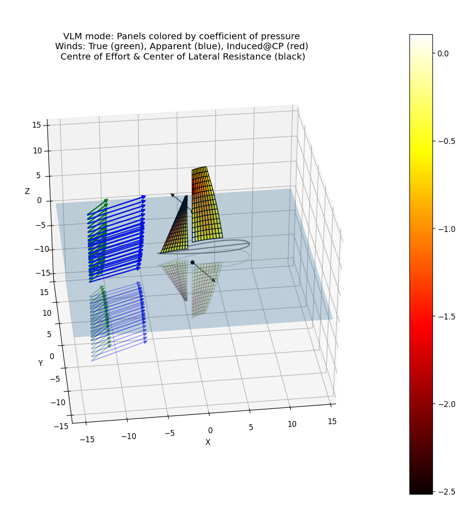

# pyLLTandVLM


[](https://circleci.com/gh/ggruszczynski/sailingVLM/?branch=main)

python implementation of a 3D Vortex Lattice Method for upwind sails

```
            The geometry is described using the following CSYS.
            lem - leading edge (luff) of the main sail
            tem - trailing edge (leech) of the main sail

                        Z ^ (mast)     
                          |
                         /|
                        / |
                       /  |              ^ Y     
                   lem_NW +--+tem_NE    / 
                     /    |   \        /
                    /     |    \      /
                   /      |     \    /
                  /       |      \  /
                 /        |       \/
                /         |       /\
               /          |      /  \
              /           |     /    \
             /            |    /      \
            /      lem_SW |---/--------+tem_SE
           /              |  /          
  (bow) ------------------|-/-------------------------| (stern)
         \                |/                          |
    ------\---------------*---------------------------|-------------------------> X (water level)
        
```

Run:
```.shell
git clone https://github.com/ggruszczynski/sailingVLM.git
cd SailingVLM
pip install -r requirements.txt  
python Examples/jib_and_main_sail_vlm_runner.py  
```

Sample output:

```.txt
Notice:
	The forces [N] and moments [Nm] are without profile drag.
	The the _COG_ CSYS is aligned in the direction of the yacht movement (course over ground).
	The the _COW_ CSYS is aligned along the centerline of the yacht (course over water).
	Number of panels per sail: 15 x 10
                               Quantity         Value
0                     F_jib_total_COG.x   -266.683479
1                     F_jib_total_COG.y    646.602335
2                     F_jib_total_COG.z    -44.590695
3               F_main_sail_total_COG.x   -385.603864
4               F_main_sail_total_COG.y   1137.121372
5               F_main_sail_total_COG.z   -215.927101
6                   F_sails_total_COG.x   -652.287343
7                   F_sails_total_COG.y   1783.723706
8                   F_sails_total_COG.z   -260.517796
9                   F_sails_total_COW.x   -805.266957
10                  F_sails_total_COW.y   1720.085511
11                  F_sails_total_COW.z   -260.517796
12                    M_jib_total_COG.x  -3362.589632
13                    M_jib_total_COG.y  -1569.839224
14                    M_jib_total_COG.z   -835.530200
15                   M_keel_total_COG.x  -1801.691230
16                   M_keel_total_COG.y   -646.320422
17                   M_keel_total_COG.z     85.841835
18            M_keel_total_COW.x (heel)  -1738.504714
19           M_keel_total_COW.y (pitch)   -800.888715
20   M_keel_total_COW.z (yaw - JG sign)    -85.841835
21             M_keel_total_COW.z (yaw)     85.841835
22              M_main_sail_total_COG.x -10150.594134
23              M_main_sail_total_COG.y  -3271.189461
24              M_main_sail_total_COG.z   2534.256594
25                  M_sails_total_COG.x -13513.183766
26                  M_sails_total_COG.y  -4841.028686
27                  M_sails_total_COG.z   1698.726394
28           M_sails_total_COW.x (heel) -13039.838572
29          M_sails_total_COW.y (pitch)  -6000.358678
30  M_sails_total_COW.z (yaw - JG sign)  -1698.726394
31            M_sails_total_COW.z (yaw)   1698.726394
32                        M_total_COG.x -15314.874996
33                        M_total_COG.y  -5487.349108
34                        M_total_COG.z   1784.568230
35                 M_total_COW.x (heel) -14778.343286
36                M_total_COW.y (pitch)  -6801.247393
37                  M_total_COW.z (yaw)   1784.568230
CPU time: 12.43 [s]
```

